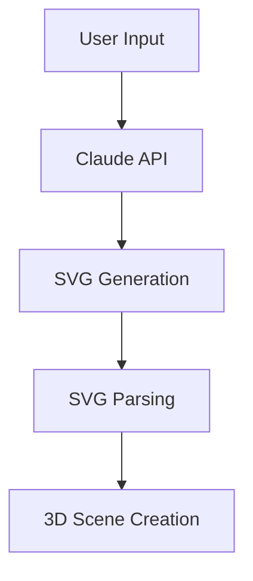

# BlenderGenAI

A Blender addon that uses Claude AI to generate complex 3D scenes from natural language descriptions.

## Overview

BlenderGenAI enables users to create AWS architecture diagrams, network topologies, and other technical diagrams in Blender using natural language descriptions. It uses Claude AI to generate SVG representations which are then converted into 3D scenes.

## Architecture

### Core Components

1. **Claude Integration**
   - `core/config.py`: Configuration and API key management
   - `core/prompts.py`: System prompts for Claude
   - `core/svg_converter.py`: Converts SVG to Blender objects

2. **Operators**
   - `operators/svg_generation.py`: Main scene generation operator
   - Handles Claude interaction and scene construction

3. **Scene Generation Pipeline**


### Object Structure
```python
class SceneComponent:
    - Type: AWS/Network/Custom
    - Position: (x, y, z)
    - Scale: (width, height, depth)
    - Properties: Dict[str, Any]
    - Connections: List[Connection]
```

## Directory Structure

```
BlenderGenAI/
├── __init__.py               # Addon entry point
├── core/
│   ├── config.py            # Configuration management
│   ├── prompts.py           # Claude system prompts
│   └── svg_converter.py     # SVG to scene converter
├── operators/
│   └── svg_generation.py    # Main operator
├── scenes/                  # Example scenes
├── tests/                   # Test cases
└── utilities.py            # Helper functions
```

## Installation

1. Clone repository into Blender addons directory:
```bash
cd ~/.config/blender/4.3/scripts/addons/
git clone [repository-url] BlenderGenAI
```

2. Set environment variables:
```bash
export ANTHROPIC_API_KEY="your-api-key"
```

3. Enable addon in Blender preferences

## Usage

1. Open Claude panel in Blender UI
2. Select scene type (AWS/Network/etc)
3. Enter scene description
4. Click "Generate Scene"

### Example Input
```text
Create a serverless API with:
- API Gateway frontend
- Lambda function for processing
- S3 bucket for storage
```

## API Integration

### Claude API
- Model: claude-3-opus-20240229
- Max tokens: 4000
- Temperature: 0
- System prompts: Defined in core/prompts.py

### SVG Conversion
- Component Mapping: SVG groups → Blender objects
- Connection Mapping: SVG paths → Curve objects
- Coordinate System: SVG (0,0 top-left) → Blender (0,0 center)

## Development

### Adding New Features
1. Create new operator in operators/
2. Register in __init__.py
3. Update UI in panel code
4. Add tests in tests/

### Testing
```bash
python -m pytest tests/
blender --python tests/test_svg_generation.py
```

### Key Files

- `core/svg_converter.py`: Core conversion logic
- `operators/svg_generation.py`: Main operator
- `core/prompts.py`: Claude system prompts

## Troubleshooting

Common issues:
- API Key not found: Check environment variables
- SVG parsing failed: Check Claude response format
- Scene offset: Check coordinate system conversion

## Future Enhancements

1. Additional scene types
2. Animation support
3. Custom component library
4. Scene export/import

## Contributing

1. Fork repository
2. Create feature branch
3. Follow Python PEP 8
4. Include tests
5. Submit pull request
