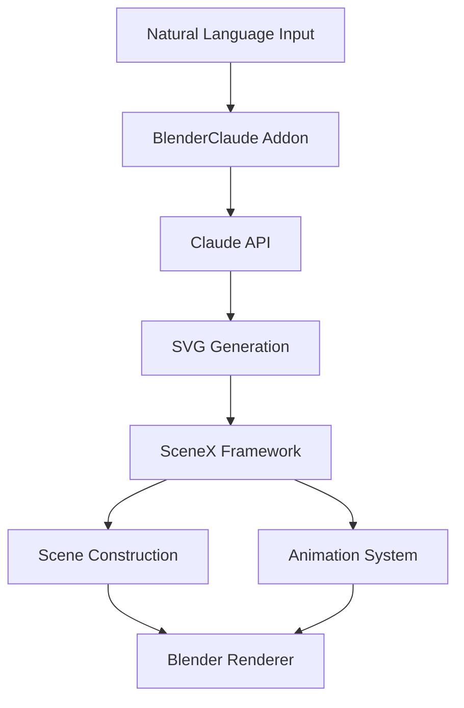

# BlenderClaude-SceneX: AI-Powered Animation Framework

## Overview
BlenderClaude-SceneX is an innovative animation framework that combines the natural language processing capabilities of Anthropic's Claude with the precision and power of Blender's 3D animation system. This integration creates a seamless workflow for generating educational and technical animations directly from natural language descriptions.

## Core Components

### 1. BlenderClaude
The BlenderClaude addon serves as the AI interface layer, providing:
- Direct communication with Claude's API
- Natural language processing of scene descriptions
- SVG generation for precise scene layouts
- Python code generation for Blender automation

### 2. SceneX
SceneX is a Manim-inspired animation framework that provides:
- Precise coordinate system for object placement
- Professional camera control and movement
- Advanced animation sequencing
- Material and lighting management
- Pre-built templates for common scenarios

### 3. Claude Integration
Claude's capabilities are leveraged in several key ways:
- Generation of SVG layouts from natural language descriptions
- Translation of technical concepts into visual components
- Creation of optimized scene structures
- Dynamic animation sequence generation

## Key Innovations

### 1. SVG-Based Scene Generation
- Claude generates SVG layouts that perfectly represent the described scene
- SVGs provide exact positioning and relationships between elements
- Automatic conversion of SVG elements to Blender objects
- Preservation of visual hierarchy and composition

### 2. Coordinate System Integration
- SceneX's precise coordinate system ensures accurate object placement
- SVG coordinates map directly to Blender's 3D space
- Automatic camera framing based on scene composition
- Smart object alignment and distribution

### 3. Animation Pipeline
1. Natural language input → Claude processes description
2. SVG generation with precise layout
3. Conversion to SceneX scene structure
4. Generation of animation sequences
5. Final render with professional quality

## Use Cases

### Technical Documentation
- Cloud architecture diagrams
- Network topology visualization
- System architecture animations
- Data flow demonstrations

### Educational Content
- Mathematical concept visualization
- Physics simulations
- Chemical process animations
- Engineering principles illustration

### Training Materials
- Software workflow demonstrations
- Hardware assembly instructions
- Safety procedure animations
- Process flow visualizations

## Technical Architecture



## Key Benefits

### 1. Efficiency
- Rapid scene generation from natural language
- Automated layout and positioning
- Reusable animation templates
- Streamlined workflow

### 2. Precision
- Exact object placement from SVG coordinates
- Professional camera framing
- Consistent visual style
- High-quality output

### 3. Flexibility
- Support for diverse content types
- Customizable templates
- Extensible animation system
- Scalable framework

## Getting Started

### Prerequisites
- Blender 4.2 or higher
- Python 3.10+
- Anthropic API key
- SceneX addon installed

### Installation
1. Install BlenderClaude addon
2. Configure API credentials
3. Import SceneX framework
4. Set up project environment

### Basic Usage
```python
# Example: Creating a cloud architecture animation
scene = TechnicalScene()
scene.process_description("""
Create an AWS architecture with:
- API Gateway frontend
- Lambda function for processing
- S3 bucket for storage
Include arrows showing data flow.
""")
scene.animate()
scene.render()
```

## Contributing
We welcome contributions! Please see our contributing guidelines for details on:
- Code style and standards
- Pull request process
- Testing requirements
- Documentation

## License
This project is licensed under the MIT License. See the LICENSE file for details.

## Acknowledgments
- Anthropic for Claude AI
- Blender Foundation
- Manim Community
- Contributors and testers

For more information and documentation, visit our [project wiki](#).


# ---------------------------------------------------------------


Phase 1: BlenderClaude SVG Enhancement
First, we need to enhance the existing BlenderClaude addon to handle SVG generation from Claude and convert it into scene elements.

Let's start by modifying the Claude_OT_GenerateSVG operator in BlenderClaude:

pythonCopyclass Claude_OT_GenerateSVG(Operator):
    bl_idname = "claude.generate_svg"
    bl_label = "Generate SVG"
    bl_options = {'REGISTER', 'UNDO'}

    # Add scene type selector
    scene_type: EnumProperty(
        name="Scene Type",
        description="Type of scene to generate",
        items=[
            ('AWS', "AWS Architecture", "Create AWS architecture diagrams"),
            ('NETWORK', "Network Topology", "Create network topology diagrams"),
            ('AI', "AI/ML Pipeline", "Create AI/ML workflow diagrams")
        ],
        default='AWS'
    )
Would you like me to provide this first modification to the BlenderClaude addon? We can then test it and move forward with the next steps.
Here's our implementation plan:

Enhance BlenderClaude with SVG capabilities ⬅ We are here
Integrate SceneX coordinate system
Create SVG to Scene converter
Implement animation generators
Add specialized scene templates
Create end-to-end workflow

Let me know if you want to proceed with the first step and I'll provide the detailed code implementation. CopyRetryClaude can make mistakes. Please double-check responses.


# ----------------------------------------------------------------

